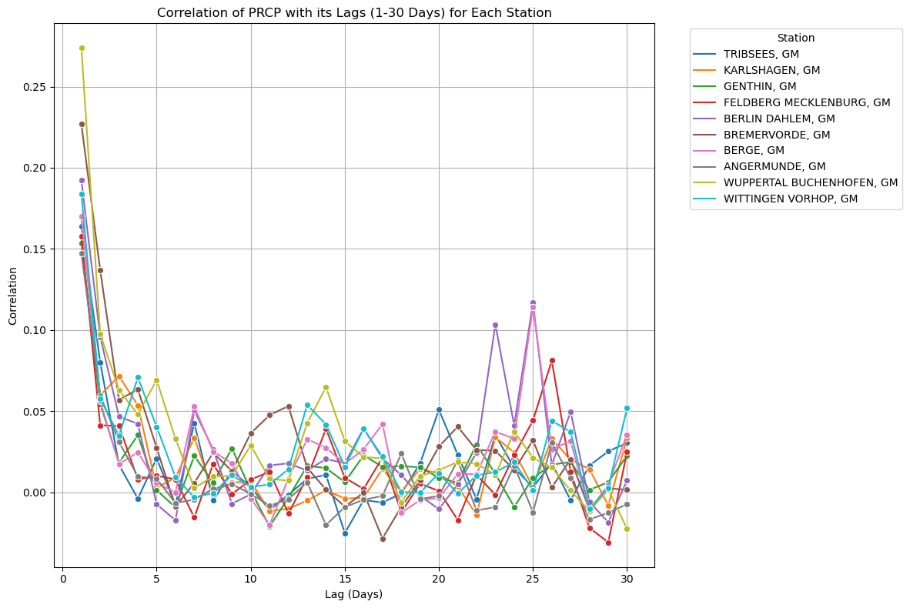

# Predicting Precipitation Events in Northern Germany

## Description
The aim is to predict the occurrence and magnitude of precipitation events exceeding 10 mm per day in Northern Germany using daily precipitation data from 10 NOAA GHCND stations. The dataset is from January 1, 2014, to March 31, 2024.

## Table of Contents
 - [Repository structure](#repository-structure)
 - [Data and Methods](#data-and-methods)
   - [Data Preprocessing](#data-preprocessing)
   - [Modeling Approach](#modeling-approach)
 - [Results](#results)
 - [Discussion and Conclusion](#discussion-and-conclusion)
 - [Possible Improvements](#possible-improvements)
 - [Time spent](#time-spent)

## Repository structure
- [ExploringData.ipynb](https://github.com/ayushprd/predicting-precipitation/blob/main/notebooks/ExploringData.ipynb) contains the initial data exploration and visualizations.
- [model_1.ipynb](https://github.com/ayushprd/predicting-precipitation/blob/main/notebooks/model_1.ipynb) contains the code for training and evaluating Random Forest, XGBoost and Linear regression models.
- [model_2.ipynb](https://github.com/ayushprd/predicting-precipitation/blob/main/notebooks/model_2.ipynb) contains the code for training and evaluating the LSTM model.

## Data and Methods
### Data Preprocessing
The precipitation values in the dataset are skewed, with most values less than 10 mm, which could lead to class imbalance issues if directly used for classification. To address this, I analyzed the correlation between current precipitation and other variables, and found a slight positive correlation with temperature. To find more stonger features, I also calculated the correlation between present precipitation and past 30 days precipitation, and found a strong correlation up to 3 days, which then decreased.

As precipitation at a point is also affected by the atmopsheric conditions in nearby locations, I also incorporated data from the three nearest stations for each station, including their lagged values for precipitation and temperature.

The final feature set comprised of station identifier, PRCP, SNWD, TMAX, TMIN, month (encoded using sine and cosine transformations), lagged values for PRCP, TMAX, TMIN, and neighboring station data.

### Modeling Approach
I evaluated four different models: Random Forest, XGBoost, Linear Regression, and LSTM. I used these models to predict the precipitation amount and then applied a rule-based classification to these predictions to classify events exceeding 10 mm.

## Results
I utilized two validation methods to assess the performance of my models:

1. Temporal split with the last year as the test set
2. Temporal cross-validation with 5 splits

### Regression Results (Temporal Split):
| Model              | MAE       | MSE        | RMSE      | R2         |
|--------------------|-----------|------------|-----------|------------|
| Random Forest      | 2.413677  | 15.988781  | 3.998597  | 0.115764   |
| XGBoost            | 2.435416  | 17.213598  | 4.148927  | 0.048027   |
| Linear Regression  | 2.367552  | 16.123818  | 4.015447  | 0.108296   |
| LSTM               | 5.833561  | 39.731750  | 6.303313  | -1.193390  |

### Classification Results (Temporal Split):
| Model              | Accuracy  | Precision  | Recall    | F1 Score   |
|--------------------|-----------|------------|-----------|------------|
| Random Forest      | 0.648742  | 0.119497   | 0.721519  | 0.205036   |
| XGBoost            | 0.705166  | 0.119792   | 0.582278  | 0.198704   |
| Linear Regression  | 0.729272  | 0.134884   | 0.611814  | 0.221037   |
| LSTM               | 0.937250  | 0.000000   | 0.000000  | 0.000000   |

### Regression Results (Temporal Cross-Validation):
| Model              | MAE           | MSE            | RMSE           | R2             |
|--------------------|---------------|----------------|----------------|----------------|
| Random Forest      | 1.760742      | 11.288620      | 3.359854       | 0.141660       |
| XGBoost            | 1.765916      | 11.977390      | 3.460836       | 0.089289       |
| Linear Regression  | 3.371652e+08  | 2.147664e+18   | 1.465491e+09   | -1.632995e+17  |
| LSTM               | 5.867324      | 40.318371      | 6.349675       | -2.053693      |

### Classification Results (Temporal Cross-Validation):
| Model              | Accuracy  | Precision  | Recall    | F1 Score   |
|--------------------|-----------|------------|-----------|------------|
| Random Forest      | 0.759593  | 0.089459   | 0.743728  | 0.159708   |
| XGBoost            | 0.795926  | 0.090933   | 0.627240  | 0.158838   |
| Linear Regression  | 0.449876  | 0.043630   | 0.808244  | 0.082790   |
| LSTM               | 0.969192  | 0.000000   | 0.000000  | 0.000000   |

## Discussion and Conclusion
Predicting precipitation using only precipitation and temperature data is challenging. Incorporating additional variables such as atmospheric pressure, humidity, and solar radiation could help improve the performance of the models. 

## Possible Improvements
This approach could be improved by,
- Hyperparameter optimization to find the best possible values for the models.
- Incorporating other atmospheric variables from reanalysis datasets like ERA5 and MERRA-2.
- Evaluating the potential of pretrained time series models in this task, as discussed in a recent [paper](https://arxiv.org/pdf/2310.10688).
- XAI methods can be like SLISEMAP and SHAP used to understand which features influence specific heavy precipitation events.

## Time spent
* understanding the problem and conceptualising a solution: 1 hr
* obtaining and processing the data: 1 hr
* writing the analysis script(s): 6 hr
* visualising results: 1 hr
* making the notebook ready for presentation: 30 mins